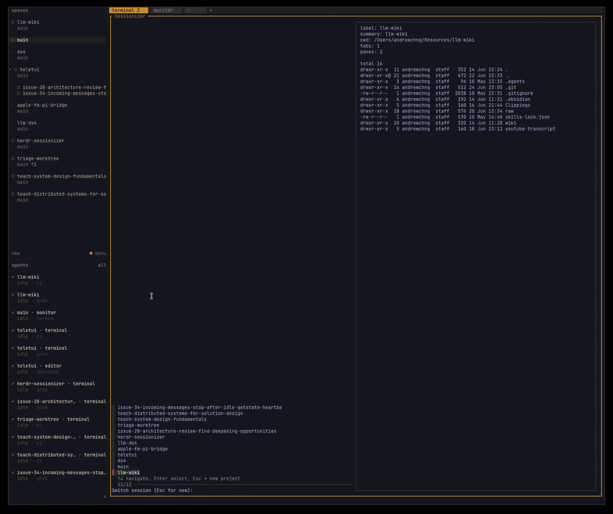

# Sessionizer

Sessionizer is a [Herdr](https://herdr.dev/) plugin that uses fuzzy pickers to open projects and Git worktrees into configured workspaces.



- **Sessionizer** — focus an existing workspace or create a new project workspace
- **Worktree** — create or reopen a Git worktree workspace

> **Platform:** macOS only for now. Tested on macOS; Linux support is planned.

## Inspiration

Inspired by [ThePrimeagen's tmux-sessionizer](https://github.com/ThePrimeagen/tmux-sessionizer): fuzzy-find a project, land in the right dev environment — but for Herdr workspaces instead of tmux sessions.

| [tmux-sessionizer](https://github.com/ThePrimeagen/tmux-sessionizer) | Sessionizer                    |
| -------------------------------------------------------------------- | ------------------------------ |
| `fzf` over project roots                                             | `fzf` over `projects.roots`    |
| tmux session                                                         | Herdr workspace                |
| tmux windows/panes                                                   | Sessionizer tab/pane layout    |
| tmux-only                                                            | Herdr-native + worktree picker |

## Requirements

Sessionizer does not install system tools for you.

- macOS (Linux planned; not validated yet)
- [Herdr](https://herdr.dev/) `>= 0.7.0`
- [Bun](https://bun.sh/) — plugin build and runtime
- [fzf](https://github.com/junegunn/fzf) — interactive pickers

```sh
curl -fsSL https://bun.com/install | bash
brew install fzf
```

Optional: [bat](https://github.com/sharkdp/bat) for richer `README.md` previews (`brew install bat`).

## Setup

```sh
herdr plugin install andrewchng/herdr-sessionizer --yes
herdr plugin config-dir sessionizer
```

Wire keybindings in your Herdr config (see [Example keybindings](#example-keybindings)).

### Local development

```sh
bun install
herdr plugin link /path/to/herdr-sessionizer
```

After manifest or pane/action changes:

```sh
herdr plugin unlink sessionizer || true
herdr plugin link /path/to/herdr-sessionizer
```

## Usage

| Flow            | Action                      |
| --------------- | --------------------------- |
| Project picker  | `sessionizer.open`          |
| Worktree picker | `sessionizer.worktree-open` |

```sh
herdr plugin action invoke sessionizer.open
herdr plugin action invoke sessionizer.worktree-open
```

**Sessionizer** lists existing workspaces plus repos under `projects.roots`. Pick a workspace to focus it; pick a project to create a workspace and apply your layout.

**Worktree** lists base repos under `projects.roots`, prompts for a branch, then reopens an existing checkout or creates a new worktree workspace with your layout.

Existing workspaces are reopened as-is. Layout bootstrap runs only for newly created workspaces.

## Layout configuration

When you pick a project or worktree in the `fzf` picker and Sessionizer **creates** a new workspace, it opens that workspace with the tabs, pane splits, and commands defined here.

`config.toml` controls two things: which repos appear in the pickers, and what layout a freshly created workspace starts with. Picking an existing workspace from `fzf` just focuses it — the layout config is not re-applied.

```text
~/.config/herdr/plugins/config/sessionizer/config.toml
```

Created automatically on first run if missing. Two parts:

- **`[projects]`** — parent folders the `fzf` pickers scan for repos
- **`[tabs.*]` + `[[tabs.*.panes]]`** — the workspace Sessionizer opens after an `fzf` pick creates a new one: tabs to add, pane splits, commands to run, and final focus via `[layout].focus`

The plugin reads the config literally — it does not invent extra tabs, panes, or commands beyond what you define.

### Example layout

```toml
[projects]
roots = ["~/Projects", "~/Workspace"]

[layout]
placement = "overlay"
focus = "editor"

[tabs.dev]
label = "dev"

[[tabs.dev.panes]]
id = "editor"
title = "nvim"
command = "nvim"

[[tabs.dev.panes]]
id = "agent"
from = "editor"
title = "agent"
split = "right"
command = "opencode"

[[tabs.dev.panes]]
id = "git"
from = "editor"
title = "lazygit"
split = "down"
command = "lazygit"
```

First tab shape:

```text
┌──────────┬─────────┐
│          │  agent  │
│   nvim   │         │
├──────────┤         │
│ lazygit  │         │
└──────────┴─────────┘
```

- `[projects].roots` — parent folders scanned by both pickers
- `[layout].placement` — how plugin panes open (`overlay` or `split`)
- `[layout].focus` — which tab or pane to focus after layout bootstrap
- `[tabs.<name>]` — one Herdr tab to create per section
- `[[tabs.<name>.panes]]` — panes inside the tab; `from` + `split` (`right` or `down`) define the split tree
- `command` — exact command a pane runs (`nvim`, `pi`, `claude`, `opencode`, etc.)

## Example keybindings

```toml
[[keys.command]]
key = "prefix+f"
type = "plugin_action"
command = "sessionizer.open"
description = "project sessionizer"

[[keys.command]]
key = "prefix+shift+u"
type = "plugin_action"
command = "sessionizer.worktree-open"
description = "create worktree workspace"
```

## Development

```sh
bun run typecheck
bun run test
bun run sessionizer
```
