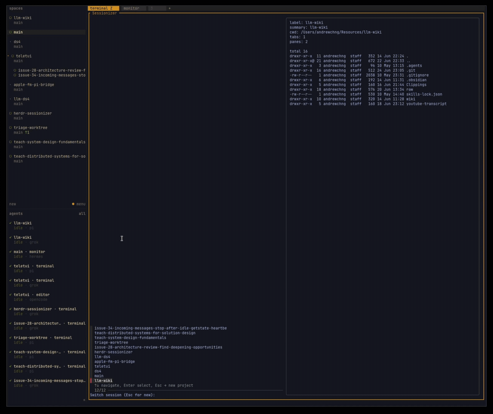

# Sessionizer

Sessionizer is a [Herdr](https://herdr.dev/) plugin that uses fuzzy pickers to open projects and Git worktrees into configured workspaces.



- **Sessionizer** — focus an existing workspace or create a new project workspace
- **Worktree** — create or reopen a Git worktree workspace, including from an open GitHub PR

> **Platform:** macOS and Linux.

## Inspiration

Inspired by [ThePrimeagen's tmux-sessionizer](https://github.com/ThePrimeagen/tmux-sessionizer): fuzzy-find a project, land in the right dev environment — but for Herdr workspaces instead of tmux sessions.

| [tmux-sessionizer](https://github.com/ThePrimeagen/tmux-sessionizer) | Sessionizer                    |
| -------------------------------------------------------------------- | ------------------------------ |
| `fzf` over project roots                                             | `fzf` over `projects.roots`    |
| tmux session                                                         | Herdr workspace                |
| tmux windows/panes                                                   | Sessionizer tab/pane layout    |
| tmux-only                                                            | Herdr-native + worktree picker |

## Requirements

Sessionizer does not install system tools for you.

- [Herdr](https://herdr.dev/) `>= 0.7.4`
- [Bun](https://bun.sh/) — required for **install/build** (and maintainer workflows). After the plugin is built, Herdr launches compiled `dist/sessionizer` — Bun is **not** required merely to open already-built actions/panes.
- [fzf](https://github.com/junegunn/fzf) — interactive pickers

```sh
curl -fsSL https://bun.com/install | bash
brew install fzf
```

Optional: [bat](https://github.com/sharkdp/bat) for richer `README.md` previews (`brew install bat`).

Optional: [`gh`](https://cli.github.com/) to list open GitHub PRs in the worktree picker (`brew install gh && gh auth login`).

## Setup

```sh
herdr plugin install andrewchng/herdr-sessionizer --yes
herdr plugin config-dir sessionizer
```

Install runs `bun install` then compiles a host-local `dist/sessionizer` binary. Actions and panes invoke that binary with a mode (`open`, `sessionizer`, `worktree-open`, `worktree`).

Wire keybindings in your Herdr config (see [Example keybindings](#example-keybindings)).

### Local development

`herdr plugin link` does **not** run the plugin build steps. Compile first, then link:

```sh
bun install
bun run build
herdr plugin link /path/to/herdr-sessionizer
```

After TypeScript changes, `bun run build` is enough — Herdr execs `./dist/sessionizer` on the next keypress. Relink only when `herdr-plugin.toml` changes:

```sh
bun run build
herdr plugin unlink sessionizer || true
herdr plugin link /path/to/herdr-sessionizer
```

To skip compile while iterating (keybinds run TypeScript via Bun), point the four manifest `command` arrays at `bun run` and relink. Bun must be on `PATH`. Restore the `./dist/sessionizer` commands before committing — `herdr plugin install` and the published plugin always use the compiled binary.

```toml
[[actions]]
id = "open"
command = ["bun", "run", "src/sessionizer/open-pane.ts"]

[[actions]]
id = "worktree-open"
command = ["bun", "run", "src/worktree/open-worktree-pane.ts"]

[[panes]]
id = "sessionizer"
command = ["bun", "run", "src/sessionizer/sessionizer-pane.ts"]

[[panes]]
id = "worktree"
command = ["bun", "run", "src/worktree/worktree-pane.ts"]
```

`bun run sessionizer` still runs the Sessionizer flow without linking or compiling.

## Usage

| Flow            | Action                      |
| --------------- | --------------------------- |
| Project picker  | `sessionizer.open`          |
| Worktree picker | `sessionizer.worktree-open` |

```sh
herdr plugin action invoke sessionizer.open
herdr plugin action invoke sessionizer.worktree-open
```

### UX flow

```text
Sessionizer (workspace picker first; Esc → projects under projects.roots)
  workspaces ──Enter──> focus
  workspaces ──Esc──> projects ──Enter──> new workspace + layout + focus
                    └──────────── Esc / none ──> exit

Worktree (always starts at repo picker)
  projects ──> branches / PRs? ──Enter──> reopen or create — see table
            └──────────── Esc / none ──> type new branch → create + layout
                                           └─ Esc ──> exit
```

| Selection                     | Result                                            |
| ----------------------------- | ------------------------------------------------- |
| Existing workspace/checkout   | Reopen as-is                                      |
| Open PR                       | Create a `pr-<n>` worktree (layout on first open) |
| Local branch                  | Create a worktree workspace for that branch       |
| Remote branch                 | Create a local worktree from that remote branch   |
| <kbd>Esc</kbd> / no choices   | Prompt for a new branch, then create the worktree |
| <kbd>Esc</kbd> at branch name | Exit the worktree flow without creating anything  |

### Open pull requests

Open PRs appear when [`gh`](https://cli.github.com/) is installed and authenticated. Drafts and fork heads are included; rows may show `[draft]` or `[fork]`. If `gh` is missing or fails, those rows are omitted and the rest of the picker is unchanged.

The git branch is always `pr-<n>`. The Herdr workspace is named `pr-<n>-<short-title>` so it is recognizable (e.g. `pr-29-fix_worktree_gate`). `git pull` inside the worktree tracks the live PR head, including pushes from fork contributors.

After the first open, the picker shows the existing `pr-<n>` workspace or checkout instead of the open-PR row. Reopening does not re-fetch or re-apply layout.

A same-repo PR can also appear as `remote branch origin/<head>` — both rows are shown on purpose. Fork PRs appear only as `open pr`.

See [Layout configuration](#layout-configuration) for when layout is applied.

### Example keybindings

Add these to your Herdr config, for example:

```text
~/.config/herdr/config.toml
```

```toml
[[keys.command]]
key = "prefix+f"
type = "plugin_action"
command = "sessionizer.open"
description = "open project workspace"

[[keys.command]]
key = "prefix+up"
type = "plugin_action"
command = "sessionizer.worktree-open"
description = "open worktree workspace"
```

## Layout configuration

When Sessionizer **creates** a new project or worktree workspace, or **opens** an existing worktree checkout, it applies the layout from `config.toml`. Focusing an existing Herdr workspace is unchanged — the layout is not reapplied.

```text
~/.config/herdr/plugins/config/sessionizer/config.toml
```

Created automatically on first run if missing.

`[ui]`, `[layout]`, and `[tabs]` are optional. A config with only `[projects]` is
valid: new workspaces then open with a plain shell and no layout is applied.
When `[tabs]` sections exist, `[layout].focus` is required.

`[ui]` controls how Sessionizer / Worktree **pickers** open inside Herdr (not
workspace bootstrap). New configs default to `overlay`. You can switch to `split`
or `popup` (Herdr `>= 0.7.4`, session-modal at `90%` width/height), or omit
`[ui]` entirely to fall back to `overlay`.

If you want an agent to help edit either the global config or a repo-local override, see [Agent skills](#agent-skills).

### Example layout

```toml
[projects]
roots = ["~/Projects", "~/Workspace"]
git_only = true
depth = 1

[ui]
placement = "overlay"   # overlay | split | popup (popup needs Herdr >= 0.7.4)

[layout]
focus = "editor"

[tabs.dev]
label = "dev"

[[tabs.dev.panes]]
id = "editor"
title = "nvim"
command = "nvim"

[[tabs.dev.panes]]
id = "agent"
from = "editor"
title = "agent"
split = "right"
ratio = 0.3
command = "opencode"

[[tabs.dev.panes]]
id = "git"
from = "editor"
title = "lazygit"
split = "down"
command = "lazygit"

[tabs.server]
label = "server"

[[tabs.server.panes]]
id = "server"
title = "server"
command = "npm run dev"
```

First tab shape:

```text
              dev
┌────────────────┬───────┐
│                │ agent │
│      nvim      │       │
├────────────────┤       │
│    lazygit     │       │
└────────────────┴───────┘
```

These diagrams show pane **titles**, not commands. Here, `ratio = 0.3` gives the new right-side `agent` pane 30% of the split width, leaving the `editor` side with the remaining 70%.

Second tab shape:

```text
   server
┌──────────────┐
│              │
│    server    │
│              │
└──────────────┘
```

- `[projects].roots` — parent folders scanned by both pickers (plain paths; optional globs — see [Glob roots](#glob-roots-optional) below)
- `[projects].git_only` — `true` returns only directories with `.git` metadata; `false` lists all immediate child folders
- `[projects].depth` — maximum levels below each root to scan when `git_only = true`; `1` means immediate children
- `[ui].placement` — how Sessionizer / Worktree pickers open in Herdr (`overlay`, `split`, or `popup`; new configs default to `overlay`, `popup` needs Herdr `>= 0.7.4`)
- `[ui].width` / `[ui].height` — popup outer size (cells or `"90%"`); only with `placement = "popup"`
- `[layout].focus` — which tab or pane to focus after layout bootstrap
- `[tabs.<name>]` — one Herdr tab to create per section
- `[[tabs.<name>.panes]]` — panes inside the tab; `from` + `split` (`right` or `down`) define the split tree
- `ratio` — optional share for the newly created pane on the split axis
- `command` — exact command a pane runs (`nvim`, `pi`, `claude`, `opencode`, etc.)

Rules for `ratio`:

- only split-created panes may set it; the first/root pane in a tab cannot
- it must be a number greater than `0` and less than `1`
- it is local to that split at creation time, not a percentage of the whole tab
- if omitted, Herdr's default split sizing is used
- it applies only when the workspace is first bootstrapped, never when an existing workspace is reopened

### Glob roots (optional)

Globs in `roots` help when clones follow a nested layout — e.g. [ghq](https://github.com/motemen/ghq)'s `host/owner/repo` tree — and you do not want to list every owner folder:

```text
~/Projects/github.com/andrewchng/herdr-sessionizer
                 └── host ── owner ── repo
```

```toml
[projects]
roots = [
  "~/Projects/github.com/*",       # expands to each owner under github.com
  "~/Projects/aur.archlinux.org",  # plain path when repos sit flat under the host
]
git_only = true
depth = 1
```

With `git_only = true` and `depth = 1`, `~/Projects/github.com/*` lists repos inside each owner, not the owner folders themselves:

```text
~/Projects/github.com/
  andrewchng/
    herdr-sessionizer/   ← listed
    dotfiles/            ← listed
  motemen/
    ghq/                 ← listed
```

The picker shows `herdr-sessionizer`, `dotfiles`, and `ghq` — not `andrewchng` or `motemen`. Non-git folders (e.g. `not-a-repo/`) are skipped.

For recursive scans (e.g. mixed or deeply nested layouts), use `**` — `~/Projects/**` — instead of `*`.

### Per-repo layout overrides

A repository can override the layout for **new** workspace bootstrap. Put a repo-local layout config at:

```text
<project>/.sessionizer/config.toml
```

When Sessionizer or Worktree creates a new workspace at `cwd`, Sessionizer checks in this order:

1. `<cwd>/.sessionizer/config.toml` — if present, use its `[layout].focus` and `[tabs.*]` (full replacement; no merge with global tabs)
2. Global `config.toml` — default layout

`[projects].roots` and `[ui]` (picker placement/size) always come from the global config. Repo-local files may include those sections, but they are ignored. Invalid repo-local config fails with an error that names the file path.

| Event                                       | Layout source                                        |
| ------------------------------------------- | ---------------------------------------------------- |
| Sessionizer creates a new project workspace | Repo override at picked `cwd`, else global default   |
| Worktree creates a new workspace            | Repo override at checkout `cwd`, else global default |
| Worktree opens an existing checkout         | Repo override at checkout `cwd`, else global default |
| Focus an existing workspace                 | No relayout                                          |

#### Example repo override

A docs repo might skip the global `nvim + agent + lazygit` layout and open lazygit with an agent instead:

```toml
# my-docs-repo/.sessionizer/config.toml
[layout]
focus = "docs"

[tabs.docs]
label = "docs"

[[tabs.docs.panes]]
id = "git"
title = "lazygit"
command = "lazygit"

[[tabs.docs.panes]]
id = "agent"
from = "git"
title = "agent"
split = "right"
ratio = 0.3
command = "pi"
```

```text
             docs
┌────────────────┬───────┐
│                │ agent │
│    lazygit     │       │
│                │       │
└────────────────┴───────┘
```

Check `.sessionizer/config.toml` into the repo if you want the layout to travel with the project. Repos without it keep the global default.

## Agent skills

This repo ships skills for agents that support the `skills` ecosystem:

- **sessionizer-layout-editor** — global Sessionizer config, `projects.roots`, repo-local `.sessionizer/config.toml` overrides

```sh
npx skills add andrewchng/herdr-sessionizer --list
npx skills add andrewchng/herdr-sessionizer --skill sessionizer-layout-editor -y -g
```

Example requests:

- "Add `~/Projects/github.com/*` to my Sessionizer project roots"
- "Add `~/Work` to my Sessionizer project roots"
- "Create a repo-local override for this repo with `lazygit` on the left and `copilot` on the right"
- "Update my global Sessionizer layout to focus the git pane"

## Development

See [CHANGELOG.md](CHANGELOG.md) for release history.

```sh
bun run typecheck
bun run test
bun run test:integration
bun run build          # produces dist/sessionizer (host-local executable)
bun run release -- <version> --dry-run
bun run release:tag -- <version> --dry-run
bun run release:notes -- <version>
bun run sessionizer    # dev: run Sessionizer flow via Bun without compiling
./dist/sessionizer --help
```

`bun run test` runs the unit suite only; `bun run test:integration` runs the real-git sandbox tests for `fetchPullRequestHead` (a tmpdir fake GitHub, no network). The integration suite is excluded from `bun test` and CI runs both — the pre-commit hook exports `GIT_DIR`, which would redirect the sandbox's git commands into the parent repository, so the sandbox suite only ever runs in CI's clean environment.

Create the release-prep branch from updated `main` (after the feature PRs merge) — never from a feature branch, or the release PR diff will include the whole feature. Use `bun run release -- <version>` on the release-prep branch to update version files, then run `bun run release:tag -- <version>` from merged `main` to create and push the annotated `v<version>` release tag.

## Support

If Herdr Sessionizer saves you a few clicks, consider [sponsoring me on GitHub](https://github.com/sponsors/andrewchng). Sponsorship funds ongoing maintenance — Herdr and fzf upgrades, issue triage, the small papercuts.
